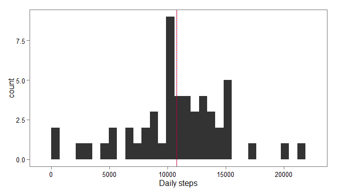
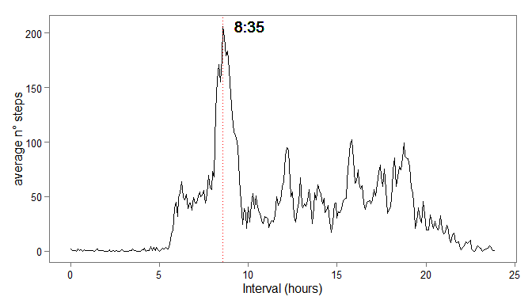
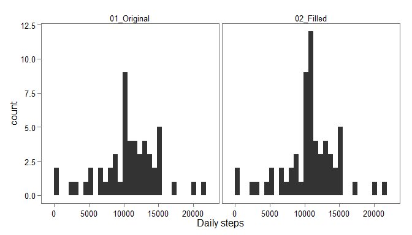
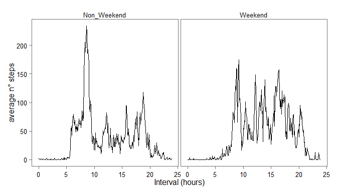

# Reproducible Research: Peer Assessment 1


## Loading and preprocessing the data

Extract zipped data, load them in R (function 'read.csv') and check dataframe 
structure.


```r
myfiles <- unzip(zipfile = "activity.zip", list = T) # read file name

unzip(zipfile = "activity.zip") # unzip the file

mydata <- read.csv(file = myfiles[1,1]) # load the file into R

str(mydata)
```

```
## 'data.frame':	17568 obs. of  3 variables:
##  $ steps   : int  NA NA NA NA NA NA NA NA NA NA ...
##  $ date    : Factor w/ 61 levels "2012-10-01","2012-10-02",..: 1 1 1 1 1 1 1 1 1 1 ...
##  $ interval: int  0 5 10 15 20 25 30 35 40 45 ...
```


It would be better to have 'date' coded as a date in R format. I create a new 
variable for that. I create also some variables to transform intervals in a 
time format.


```r
# new dataframe
interv <- data.frame(time_dec = seq(0,(24*60), by = 5)/(60))
interv$h <- floor(interv$time_dec)
interv$m <- round((interv$time_dec-floor(interv$time_dec))*60)
interv$m_ch <- sprintf("%02d",interv$m)

interv$interval <- as.numeric(ifelse(interv$h==0, interv$m, paste(interv$h, 
        interv$m_ch, sep=""))) # same format as original DF

interv$time_ch <- paste(interv$h, interv$m_ch,  sep=":")

# modify dataset


mydata$time <- interv[match(mydata$interval, interv$interval), 'time_dec']

mydata$date_r <- as.POSIXct(mydata$date)
```


## What is mean total number of steps taken per day?
I use the 'dplyr' packages to summarize daily data, and the 'ggplot2' plotting 
system (together with the 'ggthemes' package).


```r
library(dplyr)
library(ggthemes)

dailysteps <- summarise(group_by(mydata,date_r), tot = sum(steps))

ave_steps <- mean(dailysteps$tot, na.rm =T)
med_steps <- median(dailysteps$tot, na.rm =T)

ggplot(dailysteps, aes(x = tot)) + geom_histogram() +theme_few() + xlab("Daily steps") +
        geom_vline(xintercept = ave_steps, colour = 'red') +
        geom_vline(xintercept = med_steps, colour = 'blue', lty =3)
```

 

The average number of steps per
day is about 10766, very close to the median one (10765), as can be seen seen also in the
histogram (red line = mean value; blue line = median).


## What is the average daily activity pattern?


```r
# mean values for each step
ave_steps_int <-  summarise(group_by(mydata,time), ave_step = mean(steps, na.rm = T))

# interval with max average n° of steps
int_max <- ave_steps_int[which.max(ave_steps_int$ave_step), 1]
int_max_ch <- interv[match(int_max, interv$time_dec), 'time_ch']


#plot time series
ggplot(ave_steps_int, aes(x = time, y = ave_step)) + xlab("Interval (hours)") + 
        geom_line() + theme_few() +xlim(c(0,23.92)) + ylab("average n° steps") +
        geom_vline(xintercept = as.numeric(int_max), lty = 3, col = "red") +
        geom_text(aes(x = as.numeric(int_max) + 1.5, y = max(ave_steps_int$ave_step), label = int_max_ch))
```

 

The maximum average number of steps is 206.17,
recorded at the interval slot ending at 8:35


## Imputing missing values

In the following chunk there is some code to compute the numbers of NAs, create a
new column ('steps_fill'), where each NA record has been filled with the mean 
value of steps for the particular interval in which the NA fall.


```r
nNAs <- length(which(is.na(mydata$steps)))


mydata$steps_fill <- mydata$steps # creating the column

mydata$steps_fill[which(is.na(mydata$steps))] <- ave_steps_int$ave_step[
        match(mydata$time[which(is.na(mydata$steps))],ave_steps_int$time)]
   

# mean & median
dailystepsCORR <- summarise(group_by(mydata,date_r), tot_fill = sum(steps_fill),
        tot = sum(steps))

ave_stepsCORR <- mean(dailystepsCORR$tot_fill, na.rm =T)
med_stepsCORR <- median(dailystepsCORR$tot_fill, na.rm =T)


df_plot<-data.frame(x= c(dailystepsCORR$tot, dailystepsCORR$tot_fill), lab = c(rep("01_Original",
        nrow(dailystepsCORR)), rep("02_Filled", nrow(dailystepsCORR))))


ggplot(df_plot, aes(x = x)) + geom_histogram() +theme_few() + xlab("Daily steps")+
        facet_grid(.~ lab)
```

 

The histograms are quite similar, the new mean is 10766,
equal to the median. The filled dataset shows a higher density of data at the 
mean value of the distribution (due of the filling strategy).


## Are there differences in activity patterns between weekdays and weekends?

The weekdays are extracted with the 'weekdays()' function, and categorized in
weekend/non_weekend. Data are then summarized with 'ddply()' function from 'plyr'
library.


```r
# mean values for each step
mydata$weekdays <- weekdays(mydata$date_r)
mydata$weekend <- ifelse(mydata$weekdays == "Sunday" | mydata$weekdays == "Saturday",
                         "Weekend", "Non_Weekend")
library(plyr)
ave_steps_we <-  ddply(mydata, .(weekend, time), summarize,
                                    ave_step = mean(steps, na.rm = T))

ave_steps_weSUM <-  ddply(mydata, .(weekend), summarize,
                                    ave_step = mean(steps, na.rm = T))

#plot time series
ggplot(ave_steps_we, aes(x = time, y = ave_step)) + xlab("Interval (hours)") + 
        geom_line() + theme_few() +xlim(c(0,23.92)) + ylab("average n° steps") +
facet_grid(.~ weekend)
```

 


The patterns are different between the week days and the week-end: the average n°
 of steps is higher during weekend (43.08) than in the
 other days (35.34), but the peak interval is recorded
 in the latter period in the morning.
